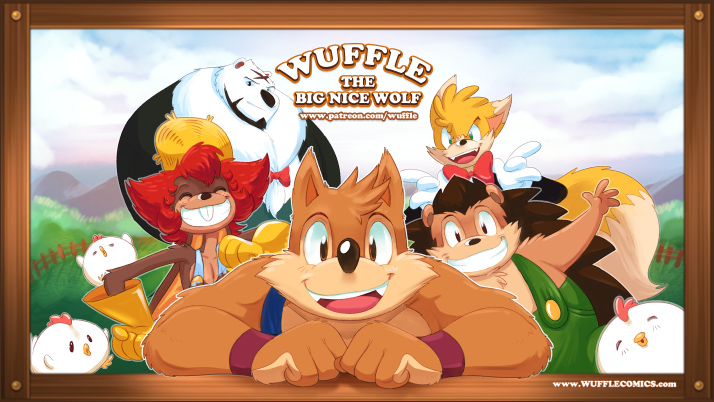

Free "public domain" resources for READING comics

## Comics
  
> [**Wuffle comics**](wuffle/)  
> A feel-good comic series that will make you laugh out loud, brighten up your day, and make you smile. 
> It bring back the old charms of the good' old classic cartoon that we saw when we were young.  
> For everyone.  
> "**Wuffle** is different from other wolves. While most wolves are sneaky and tricky, Wuffle is innocent, naive, and kind-hearted, always willing to help people without expecting anything in return."  
> Wuffle comics uses [**"CC0 1.0 Universal (CC0 1.0)"** or **"NO COPYRIGHT"** policy](/wuffle/license.md) : you can copy, modify, distribute, and perform the work, even for commercial purposes, all without asking permission.  

## Licenses
- **Main content** : [Creative Commons CC0 Public Domain Dedication](LICENSE) *(unless otherwise stated)*
- **Other content, data and media** use "public domain" or similar licenses, among :
  - a Public Domain dedication 
  - the [Creative Commons CC0 Public Domain Dedication](LICENSE)
  - the Unlicense
  - the BSD Zero Clause License
  - the MIT No Attribution
  - the WTFPL
  - *see LICENSE file/mention, for each work*
- **Uses** : 
  - for any purpose
  - separate or derivative work
  - copyrighted or non-copyrighted work
  - commercial or non-commercial work
  - no warranties provided, of any kind, express or implied
  - citations appreciated, but not required
  - in many cases, any trademarks and patents belong to their respective owners (and must be treated accordingly, in any derivative work)
  - verify LICENSE files/mentions, accordingly to each work, in case of -rare- exceptions

## Contacts
- **Public forum** : use the "[Discussions](https://github.com/MechatronicBeing/resources/discussions)"
  - for conversations (but not issues) with the community 
  - a github account is needed
- **Public issues** : use the "[Issues](https://github.com/MechatronicBeing/resources/issues)"
  - for bugs or errors, new features or requests, helps wanted, questions (but not public conversations)
  - a github account is needed
- **Private message** : MechatronicBeing
- **Social media** : no. 
